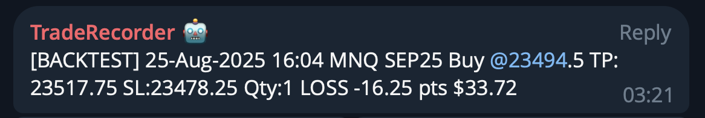

# TradeSenderBot + Telegram — Guía Rápida (NinjaTrader)

Esta guía te ayudará a:

1) Instalar el **TradeSenderBot** (script de NinjaTrader) en un gráfico  
2) Crear y conectar un **bot de Telegram** para recibir tus operaciones en el chat  
3) Probar y solucionar posibles errores

---

## 0) Requisitos

- **NinjaTrader 8** (probado con la versión 8.x)  
- Un instrumento de **futuros, forex o CFD** con datos históricos (para generar las velas del contexto)  
- Opcional: una **API** funcionando (si quieres guardar y graficar las operaciones)  
- Una cuenta de **Telegram** (móvil o escritorio) para crear un bot

---

## 1) Importar y colocar el indicador en un gráfico

1. Abre NinjaTrader → **New** → **NinjaScript Editor**  
2. Haz clic derecho sobre la carpeta `Indicators` → **New Indicator** → cierra el cuadro de diálogo.  
3. Reemplaza el contenido del nuevo archivo con el script completo **`TradeSenderBot`** y **compila** (F5).  
   - Deberías ver en la ventana de salida el mensaje `TradeSenderBot [versión]` cuando se inicializa.
4. Abre un gráfico del instrumento (por ejemplo, **MNQ SEP25**).  
5. Haz clic derecho en el gráfico → **Indicators...** → agrega **TradeSenderBot**.

### Propiedades recomendadas

- **EnabledPosting**: `True` *(actívalo solo después de configurar TelegramToken o ApiUrl)*  
- **Environment**: deja **vacío** para que se detecte automáticamente (backtest/sim/real según la cuenta) o define manualmente `backtest|sim|real`.  
- **ApiUrl**: [Opcional] tu endpoint de API (ejemplo: `http://TU-HOST:5055/upload`) para registrar las operaciones además del bot de Telegram.  
- **AccountName**: selecciona la cuenta donde ejecutas las operaciones.  
- **ContextBars**: [Opcional] el número `30` *(velas antes y después de la entrada/salida)* que se incluirá en el contexto para dibujar el gráfico.  
- **IncludeExitContext**: `True` — indica si se incluye una pequeña ventana de velas alrededor del **punto de salida** además del **de entrada** (hace que el gráfico generado muestre toda la operación).  
- **CommissionPerContract**: `1.20` *(coste redondo por contrato)*  
- **DetectTP_SL**: `True` *(detecta TP/SL de las órdenes ATM con nombres "Target/Stop")*  
- **TelegramEnabled**: `True` si quieres notificaciones en Telegram  
- **TelegramBotToken**: token del bot (obtenido de **BotFather**)  
- **TelegramChatId**: ID numérico del chat o grupo donde el bot enviará los mensajes (debe ser administrador)

> Si **ApiUrl** está vacío, el envío se desactiva automáticamente por seguridad.  
> Telegram también se desactiva si faltan el Token o el ChatId.

Cuando el indicador se inicia, verás un resumen en **New → Output** (o Control Center → **Log**).

---

## 2) Crear un bot de Telegram

1. En Telegram, abre **@BotFather** y envía `/newbot`.  
2. Elige un **nombre** y un **nombre de usuario** (debe terminar en `bot`, ej. `TradeRecorderBot`).  
3. Copia tu **token HTTP API** (similar a `123456:ABC-...`).  
4. Inicia un chat con tu bot (puede que necesites hacerlo administrador si es un grupo) y envía **/start** una vez para activarlo.

### Obtener tu chat ID

- **Chat personal**: abre en el navegador  
  `https://api.telegram.org/bot<TU_TOKEN>/getUpdates`  
  Envía un mensaje al bot y refresca. En el JSON verás `"chat":{"id": ... }` → ese es tu **chat_id**.
- **Grupos**: agrega el bot al grupo, envía un mensaje y revisa `getUpdates` igual que antes.

### Introducir las credenciales en el indicador

En el gráfico, abre **Indicators... → TradeSenderBot** y configura:

- **TelegramEnabled**: `True`  
- **TelegramBotToken**: *(pega el token)*  
- **TelegramChatId**: *(pega el ID numérico)*

No es necesario recompilar: simplemente pulsa **OK**.

---

## 3) Enviar una operación de prueba

- Abre y cierra rápidamente una posición (entrada y salida de mercado).  
- El indicador agrupa las ejecuciones hasta que tu **posición neta vuelva a 0**, luego calcula la operación y envía:
  - JSON al `ApiUrl` (si EnabledPosting=True y ApiUrl está configurado)
  - Un mensaje a Telegram, por ejemplo:



Si conectaste la API, tu servidor puede responder con una imagen del gráfico y almacenarla.

---

## 4) Formato del mensaje en Telegram

```
[BACKTEST] 25-Aug-2025 16:04 MNQ SEP25 Buy @23494.5 TP:23517.75 SL:23478.25 Qty:1 LOSS -16.25 pts $33.72
```

- **Environment** entre corchetes (BACKTEST|SIM|REAL)  
- **Hora** según tu zona horaria local  
- **Símbolo**, **lado**, **entrada**, **TP/SL** (si se detectan), **cantidad**  
- Resultado como **WON/LOSS/FLAT**, **puntos** y **neto en USD** (comisión incluida)

> TP/SL se infieren de nombres de órdenes ATM que contengan `Target/Profit` o `Stop`. Si no usas ATM o los nombres son distintos, TP/SL puede aparecer como `—`.

---

## 5) Solución de problemas

- **No aparecen mensajes**  
  - Verifica **EnabledPosting** y **ApiUrl**; el servidor debe ser accesible desde el PC donde corre NinjaTrader.  
  - Consulta el **Log** del Control Center o la salida del script para ver líneas `[HTTP]` y códigos de estado.
- **Telegram no envía nada**  
  - Asegúrate de que **TelegramEnabled=True**, y que el token y chat_id estén configurados; revisa las líneas `[Telegram]` en los logs.
- **Environment incorrecto**  
  - Deja **Environment** vacío para que se detecte automáticamente (`Playback` → backtest, `Sim` → sim, el resto → real), o configúralo manualmente.
- **Operaciones duplicadas o parciales**  
  - El indicador solo envía los datos **una vez estés plano** (posición neta = 0). Si entras y sales parcialmente, agrupa las operaciones en una sola.

---

## 6) Seguridad y privacidad

- El script **nunca guarda** tu token de Telegram ni tu chat ID.  
- **EnabledPosting** está desactivado por defecto y **ApiUrl** vacío — nada se envía fuera de tu PC a menos que tú lo actives.  
- Si distribuyes el indicador, mantén estos valores por defecto y deja que cada usuario use sus propias credenciales.

---

## 7) Referencia rápida (propiedades)

- `EnabledPosting` *(bool)* – interruptor principal para el envío HTTP  
- `Environment` *(string)* – `backtest|sim|real` o vacío para automático  
- `ApiUrl` *(string)* – ej. `http://HOST:5055/upload`  
- `AccountName` *(string)* – nombre de cuenta (por defecto `Sim101`)  
- `ContextBars` *(int)* – velas de contexto antes/después (por defecto 30)  
- `IncludeExitContext` *(bool)* – incluir contexto en la salida  
- `CommissionPerContract` *(double)* – comisión por contrato (ida y vuelta)  
- `DetectTP_SL` *(bool)* – detectar TP/SL por nombre de orden  
- `TelegramEnabled` *(bool)* – enviar mensajes a Telegram si está activado  
- `TelegramBotToken` *(string)* – token del bot de BotFather  
- `TelegramChatId` *(string)* – id del chat o grupo de destino

¡Feliz trading! ✨

[🇬🇧 Read in English](./README.md)